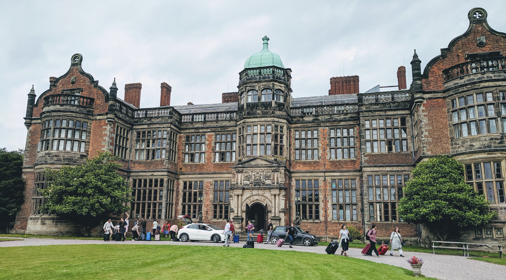

> _I walked with my lover, hand in hand, looking down at blue gems winking in the green grass when my tears would let me. We stopped, and I heard Death say,_
>
> _"Now it is time to gather flowers for your departed. You will need them."_

<figure>

<figcaption>

Ingestre Hall. Photo taken by author.

</figcaption>

</figure>

This past week I spent time at a LARP called [Just a Little Lovin'](https://jall2019.weebly.com/) by Hanne Grasmo and Tor Kjetil Edland. It is a game about the AIDS epidemic in the NYC LGBT community in the 1980s. **This writing has a content warning for AIDS, death, romance, sexual content, homophobia, religion, cheating, and self harm.**

The event took place at the gorgeous Ingestre Hall in Staffordshire in the UK. It was an elegant backdrop to the story, sometimes overwhelmingly so. The story took place over three acts spread out over the course of six days, each act being a single year with a theme.

In this I will skip the details of what happened specifically with my character chronologically, and focus more on the impressions this experience has left on me. I'll leave some links below with other articles about this event for those wanting a better sense of what happened.

### Desire

<figure>

<figcaption>

Priest, 1982

</figcaption>

</figure>

> _Our eyes kept meeting across the hall, her wicked smile mirroring the wickedness in my heart. When we finally kissed, it was if the devil himself had possessed me. I was helpless, and I didn't care that she was cheating so long as she would touch me again._

This is an experience centered on queerness. Yes, there are characters that are nominally straight, but even they exist in alternative communities within the game world. It is a world of exceptions, with "normal" lurking beyond that place and time.

This was powerful for me. It's something I seek in my life, so this world felt like a familiar one. It definitely was not my own, mostly in it's centering of white gay men in a way that my trans and queer spaces do not.

I played Priest, a cis bisexual in denial who called herself a lesbian after she didn't fit the mold she was forced into of a husband and kids. This is a person who I can relate to: someone who loves deeply, who hurts, who runs from her own past. At times I felt like I was playing too close to home, and the bleed between her life and mine was strong.

I stepped into a world of gays and lesbians, a time where bisexuals were not real and trans people barely thought of. Where queer was a word used by our oppressors and nothing more. It was perhaps a less nuanced and accepting time than the here and now, but it also was one that was part of the foundation my world rests on.

Desire was rampant. I consider myself fairly experienced in debauchery, but the world was one where sexual promiscuity was the flagrant norm. Seeing couples engage just out of sight was common, and my character was part of this world as much as any.

Priest hooked up with many people. Too many, honestly. The hurt and guilt from their internalized homophobia was too much. Distracting from that with a moment of pleasure and intimacy helped, even if they felt worse later. After is always a problem for another day.

With the sex came interpersonal conflict. The little clique I was part of, the Cubbyhole, had a mixture of unhappy relationships, crushes, history, and drama. We gleefully fed the fires of this, making decisions in the moment. The men there were sharing a similar world, but we had our own petty problems and didn't interact very much.

This quickly changed with the year.

### Fear of Death

> _We danced, the boy I had flirted with for so long. He was shy, but definitely interested. At least, as interested as a gay boy can be. As the song changed and we pressed our bodies together in a slow dance, his smiles started to give way to tears. I held his body as it shook, and I remembered that he was posi. His youth would not last long._
>
> _The next day, I prayed over the body of his husband._

The boys were dying. Dying so fast. A disease was spreading through blood and sex and nobody on the outside world cared. Called it regrettable, when they didn't say we all deserved it. But they all chalked us off from this world years ago, why should things be any different now?

We tried. Our group's drama gave way to support groups and trying to do something. We were together, and even if we were less affected than the boys. It didn't matter. There wasn't a cure, and death happened in a few years at most.

Priest's spirituality bloomed, her background as a Methodist vicar coming to the forefront as people needed some sort of closure. Even if she couldn't forgive herself, even as she sinned with sex and self harm, she could offer something. It wasn't enough, but it was still something.

I held so many people crying, heard so many confessions. Shed so many tears. The shadow of fear touched everyone. We didn't know how this was spread, who had it. Who was next.

Eventually tests were available, but it did not make things better, just clearer.

I held a man of wit and sarcasm as he broke down. Every single person he loved was positive, and he would watch them slowly die. Assuming he didn't die first, that is: he didn't care enough about himself anymore to find out.

A sister of mine came to me, a woman who I lived with and considered dear to my heart. She handed me a letter with death spelled out, and we talked about how to continue to exist with this burden. I reassured her that I loved her still, and helped her tell the rest of us.

There was a wedding. As the grooms kissed and the party celebrated, I joined in. I hid my tears with the knowledge they were both dying.

We screamed and cried and laughed at the cabaret. The performers danced and sang with beauty and grace, daring the world to pull them down. Most of them would die soon.

A man of power and strength welcomed us to the manor every year. He sang praises to the country we lived in. When he died, that same country did not mourn him. We did.

All of us were so afraid, we could lose anyone at any moment. Connections were hard, trysts tainted. The world was a darker place, and there was no way back.

### Friendship

> _It was late at night, hazy glow of alcohol and drugs giving way to a bone weariness. The girls and I were snuggled together, a sleepy pile as we talked about our dreams. We talked of moving in together, get a house to support each other and building something. Maybe it would even last._

In death, life. Despite the hardship and fear, the community came together far stronger than before. Our bars became abandoned as we met instead as activists and supporters. We created art together, celebrating what we did have. We lived brightly and were unstoppable in our love.

I built so many fierce friendships, felt so many strong feelings, and was supported and in turn supported in this hard time. One of my favorite poets, Andrea Gibson, has a line that always sticks with me: "I don't want a soft death, I want a hard life".

It would be so easy to give up. To just stop fighting and let the world stamp your flame out. We didn't let that happen, though. We fought till we couldn't any more and kept going after that. We activated against a government and culture that wanted us to just die, forcing an unwilling population to see what they are doing, to face their sins.

Did it work? I don't know. Even today, most people don't know or acknowledge what happened. But that doesn't matter, it was still important to keep that fire going.

The last few hours of my experience was spent discovering love after so much self loathing and fear. It was redemption, letting Priest feel beyond the emptiness and sorrow inside.

There was still fear, and still loss. I held my love's hand as we waited for our test results. I cried over a friend in his early grave. But finding something for your soul beyond just existing made the other burdens sit a bit lighter.

### Aftermath

I write this nearly a week after I said goodbye to Priest. At the end of the event, I went to the field where the coffins once were, and spoke a eulogy for her. I praised her bravery, her heart, and acknowledged her pain as real even if she is fiction.

Every day, I still cry over what happened. The tears are less as reality continues to intrude, but the message resonates in my mind still. Hope.

The AIDS epidemic still burns strongly even as we develop better medication. The public still doesn't acknowledge what happened. Even the new generation of queers wasn't there and don't know what it was like.

Honestly, I'm not sure I know either. I experienced a tiny slice of something, but I can't remotely compare that to the real world. It's art, there to educate and broaden my empathy but still isn't reality. That doesn't make it unimportant, just something to keep in mind.

I live in New York City. I did JALL because I walk on these streets every day, and feel the ghosts sometimes. I couldn't speak with them before.

But after this, maybe I can listen a bit better?

### Other Words

- [Play the Gay Away – Confessions of a Queer Larper](https://nordiclarp.org/2016/04/15/play-gay-away-confessions-queer-larper/)
- [Possibilities of Queer Community Building Through LARP](http://www.firstpersonscholar.com/queer-larp-community/)
- [Just a Little Lovin’ USA 2017](https://nordiclarp.org/2018/02/19/just-little-lovin-usa-2017/)
- [In the Pink: Katherine's Story](https://savvyseductress.wordpress.com/)
